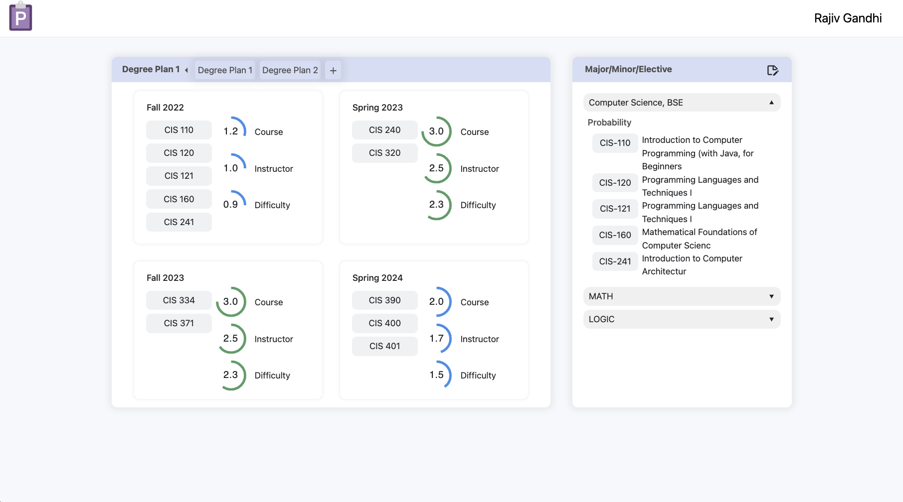

## Penn Degree Plan

The app has finished the transition from React with Redux to next.js with no Redux. This was done to provide the possibility for server-side rendering and a more light-weight frontend framework. Here's what it looks like:



To run the development server:
```
yarn install

npm run dev
# or
yarn dev
```

Currently, the following features are implemented and ready for testing:

Degree requirements
- expand/collapse major to see/hide requirements
- switch to edit mode by clicking edit button at top right corner of requirement panel
- rearrange degrees in edit mode

Courses planned
- animation showing stats for all courses planned in a semester, including course quality, instructor quality, and difficulty
- drag a course from requirement panel and drop it in a semester in planning panel
- drag courses across semesters in planning panel
- delete a course from a semester by hovering over it and clicking the delete button that shows up

Degree plans
- see all degree plans by expanding the top tab bar in planning panel
- switch to a degree plan by clicking on its tab
- create a new degree plan and give it a name from input box
- current plan is switched to the new plan upon creation

TODO: 

Degree requirements
- integrate types with backend
- style adjustment

Courses planned
- divider to seperate current and past semesters
- display more statistics

Degree plans
- check with Aagam about data models, create temp data to implement types on the client side
- should be able to switch between degree plans freely
- style fix for dnd components (crop margin) 
